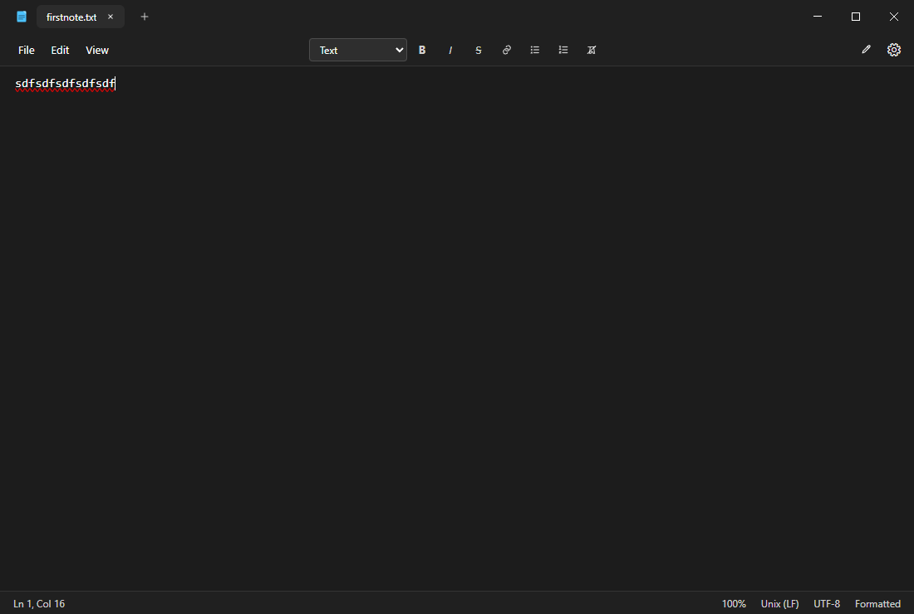
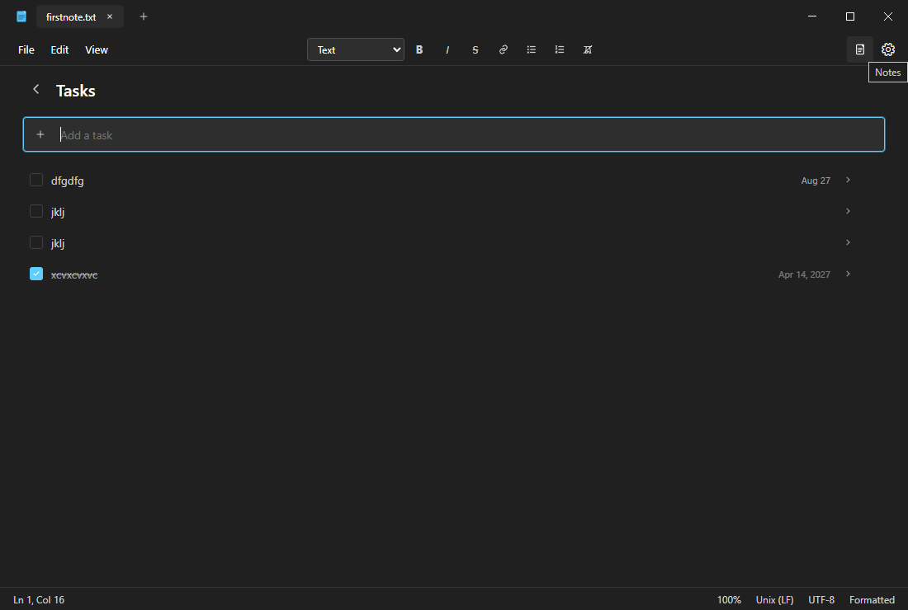
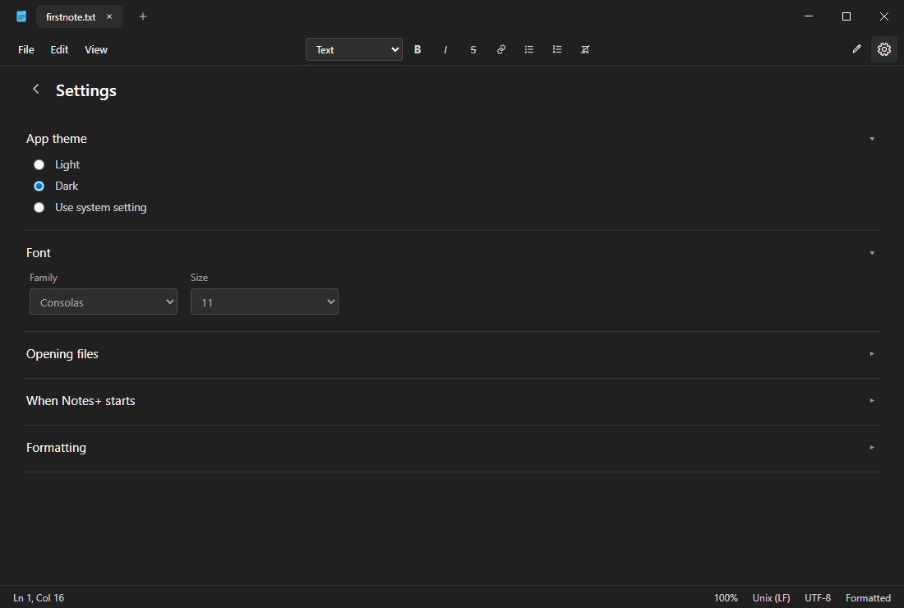

# Notes+

Notes+ is a desktop text editor that looks like Windows 11 Notepad. It is dark themed and supports live Markdown formatting.

## Screenshots

**Notes**

The editor with tabs, menus, and live formatting.



**Tasks**

A task list with due dates. Open a task for details.



**Settings**

Theme, font, and how files open.



## Run

Install Node.js. Open this folder and run:

```
npm install
npm run dev
```

## Features

Open files in tabs
Save as txt or md
Switch between formatted view and Markdown syntax
Find and replace
Restore your last session
